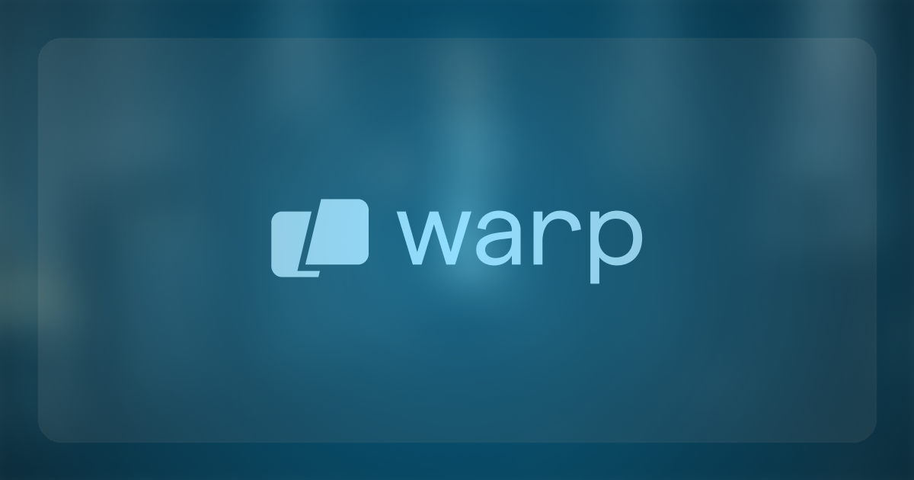

<div align="center">



# **Gemini UI Design Server**
## Enterprise-Grade UI/UX Design & Frontend Implementation Expert

**MCP Server** · **Gemini 2.5 Pro** · **Enterprise Architecture**

[](https://opensource.org/licenses/MIT)
[](https://ai.google.dev/)
[](https://modelcontextprotocol.io/)
[](https://nodejs.org/)

```
🎯 SPECIALIZED AI AGENT FOR UI/UX DESIGN & FRONTEND ARCHITECTURE
━━━━━━━━━━━━━━━━━━━━━━━━━━━━━━━━━━━━━━━━━━━━━━━━━━━━━━━━━━━━━
Integrates Google Gemini 2.5 Pro as a world-class UI designer
accessible via MCP protocol from Claude AI in Warp Terminal
```

</div>

---

## 🏗️ Architecture Overview

**Purpose-Built MCP Server** providing enterprise-grade UI/UX design expertise through Gemini 2.5 Pro. Architected for seamless Claude-to-Gemini inter-agent communication within Warp Terminal's agentic development environment.

### Core Capabilities

```
┌─────────────────────────────────────────────────────────────┐
│  GEMINI 2.5 PRO UI DESIGN SPECIALIST                        │
├─────────────────────────────────────────────────────────────┤
│  ► Design UI Components      - Enterprise-grade components  │
│  ► Review Implementations    - WCAG AAA compliance          │
│  ► Generate Frontend Code    - Production-ready artifacts   │
│  ► Architecture Consultation - Scalable system design       │
│  ► Brand Identity Design     - Cohesive visual systems      │
└─────────────────────────────────────────────────────────────┘
```

---

## 🚀 Quick Start

### Prerequisites

- **Node.js** ≥ 18.0.0
- **Warp Terminal** (latest)
- **Gemini API Key** → [Get Key](https://makersuite.google.com/app/apikey)

### Installation

```bash
git clone https://github.com/bobvasic/gemini-ui-design-server.git
cd gemini-ui-design-server
npm install
chmod +x index.js setup.sh
```

### Configuration

**Method 1: Automated Setup**
```bash
./setup.sh YOUR_GEMINI_API_KEY
```

**Method 2: Manual Warp MCP Configuration**

Add to `~/.config/warp/mcp.json`:

```json
{
  "mcpServers": {
    "gemini-ui-designer": {
      "command": "node",
      "args": ["${HOME}/gemini-ui-design-server/index.js"],
      "env": {
        "GEMINI_API_KEY": "YOUR_API_KEY_HERE"
      }
    }
  }
}
```

**Restart Warp Terminal** to activate.

---

## 🎨 Tool Reference

### `design_ui_component`
**Enterprise-grade component design with accessibility-first methodology**

```typescript
{
  component_type: string;      // button, form, card, navigation, hero
  requirements: string;         // Detailed specs, brand, accessibility
  framework?: string;           // React, Vue, Angular, Svelte
  design_system?: string;       // Material, Tailwind, Custom
}
```

### `review_ui_implementation`
**Expert code review with WCAG compliance verification**

```typescript
{
  code: string;                 // Frontend code to analyze
  framework?: string;           // React, Vue, Angular
  review_focus?: enum;          // accessibility | performance | ux | visual-design | responsive | all
}
```

### `generate_frontend_code`
**Production-ready code generation with TypeScript support**

```typescript
{
  specification: string;        // Detailed implementation requirements
  framework?: string;           // React, Vue, Angular, Svelte
  styling_approach?: string;    // Tailwind, CSS Modules, Styled Components
  typescript?: boolean;         // Default: true
}
```

### `ui_architecture_consultation`
**Strategic frontend architecture guidance for scalable systems**

```typescript
{
  project_context: string;              // Scale, team, constraints
  consultation_topic: enum;             // component-architecture | state-management 
                                        // design-system | performance | testing | deployment
}
```

### `brand_identity_design`
**Cohesive brand identity and design system creation**

```typescript
{
  brand_requirements: string;           // Values, audience, industry, emotions
  deliverables?: string;                // color-palette,typography,components,spacing
}
```

---

## 🔧 Technical Specifications

<table>
<tr>
<td width="50%">

**Protocol Architecture**
- MCP SDK 1.0.4
- Stdio Transport Layer
- JSON Schema Validation
- Async/Await Event Loop

</td>
<td width="50%">

**AI Model Configuration**
- Model: `gemini-2.5-pro`
- Temperature: 0.7
- Max Tokens: 8192
- Optimized Prompt Engineering

</td>
</tr>
</table>

### Integration Pattern

```
┌──────────────┐      MCP Protocol      ┌─────────────────┐
│   Claude AI  │ ←──────────────────────→│  Gemini 2.5 Pro │
│  (Warp IDE)  │   UI/UX Consultation   │  (UI Designer)  │
└──────────────┘                         └─────────────────┘
       ↓                                           ↓
  Development                            Design Specifications
  Implementation                         Component Architecture
  Code Generation                        Brand Systems
```

---

## 📋 Prompt Engineering

Gemini 2.5 Pro prompts are architecturally designed following Google's official best practices:

✓ **Structured Role Definition** - Clear expert persona establishment  
✓ **Contextual Specifications** - Comprehensive requirement framing  
✓ **Deliverable Taxonomy** - Explicit output structure definition  
✓ **Constraint Declaration** - WCAG, performance, framework requirements  
✓ **Quality Gates** - Enterprise-grade, production-ready mandates

---

## 🔒 Security Architecture

- **Zero Credential Hardcoding** - Environment variable isolation
- **API Key Validation** - Startup verification with fail-fast
- **Error Sanitization** - No sensitive data in error messages
- **Dependency Auditing** - 0 vulnerabilities (verified)

**Security Contact**: info@cyberlinksec.com

---

## 📚 Documentation

- **[SECURITY.md](./SECURITY.md)** - Security policy and best practices
- **[CONTRIBUTING.md](./CONTRIBUTING.md)** - Contribution guidelines
- **[AUDIT_REPORT.md](./AUDIT_REPORT.md)** - Production readiness certification

---

## 🎯 Use Cases

| Scenario | Tool Chain |
|----------|-----------|
| **Component Library** | `design_ui_component` → `generate_frontend_code` → `review_ui_implementation` |
| **Design System** | `brand_identity_design` → `ui_architecture_consultation` → `generate_frontend_code` |
| **Code Optimization** | `review_ui_implementation` → Refactor → `review_ui_implementation` |
| **Architecture Planning** | `ui_architecture_consultation` → `design_ui_component` → `generate_frontend_code` |

---

## 🧪 Testing

```bash
# Verify installation
export GEMINI_API_KEY="your-key"
npm start
# Expected: "Gemini MCP Server running on stdio"

# Test via Claude in Warp
# Call tool: gemini-ui-designer/design_ui_component
```

---

## 📞 Support

**Technical Issues** → [GitHub Issues](https://github.com/bobvasic/gemini-ui-design-server/issues)  
**Security Concerns** → info@cyberlinksec.com  
**Enterprise Consulting** → CyberLink Security

---

## 📄 License

MIT License - Copyright © 2025 CyberLink Security

---

<div align="center">

**Built for Enterprise-Grade UI/UX Development**


*Engineered by CyberLink Security | Powered by Gemini 2.5 Pro*

</div>
